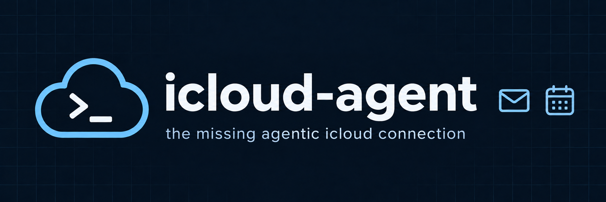

<p align="center">
  
</p>

<h1 align="center">icloud-agent</h1>
<p align="center"><strong>the missing agentic icloud connection</strong></p>

<p align="center">
  <a href="https://github.com/MarkUnthank/icloud-agent/actions/workflows/test.yml"></a>
  <a href="https://github.com/MarkUnthank/homebrew-tap"></a>
  <a href="pyproject.toml"></a>
  <a href="LICENSE"></a>
  <a href="docs/clients.md"></a>
  <a href="VERIFICATION.md"></a>
</p>

<p align="center">
  <a href="#quick-start">Quick start</a> ·
  <a href="docs/usage.md">Usage</a> ·
  <a href="docs/reference.md">Tool reference</a> ·
  <a href="docs/clients.md">Agent setup</a> ·
  <a href="CONTRIBUTING.md">Contribute</a>
</p>

Give your local agent access to iCloud Mail and Calendar. Search your inbox, draft
replies, and manage events through a CLI, companion skill, or local MCP connection.

**Runs on your computer. Connect once. Invoke when you need it.**

> **Alpha.** Live iCloud account behavior remains unverified. See the
> [verification record](VERIFICATION.md) for completed tests and remaining checks.

## Quick start

Install with [Homebrew](https://brew.sh/) on macOS:

```sh
brew install MarkUnthank/tap/icloud-agent
icloud-agent setup --codex
icloud-agent auth login
```

You need an iCloud Mail account, Apple Account two-factor authentication, and Codex
on PATH for `setup --codex`.

Login opens Apple's account page. Generate an **app-specific password** and enter it
in the hidden terminal prompt. It is saved in your OS credential store for future
invocations. **Enter it in your terminal, never in chat.**

Restart Codex, then try:

> “Use iCloud Agent to show my unread emails.”
>
> “Check my calendar for tomorrow.”
>
> “Draft a reply to this email.”

Or use the CLI:

```sh
icloud-agent mail search
icloud-agent calendar list
icloud-agent schema mail_draft
```

See [setup](docs/setup.md) for `uv`/`pipx` installation, upgrades, and removal.

## What it can do

| | Operations | Limits |
|---|---|---|
| **Mail** | Search and read messages, save and send drafts, mark read/unread, move between folders | Plain-text drafts; attachment metadata only; one account |
| **Calendar** | List calendars, find events and recurring occurrences, create/edit/delete personal events | No recurrence editing, invitations, or RSVP management |

Reading and searching leave mail unread. See [usage](docs/usage.md) for sending and
editing workflows.

## Where it runs

| Client | Integration |
|---|---|
| **Codex locally** | `icloud-agent setup --codex` registers MCP and installs the skill |
| **Other local agents** | Run `icloud-agent mcp` as a stdio subprocess, or invoke the CLI |
| **ChatGPT desktop local work** | Plugin included; client/account compatibility is unverified |
| **ChatGPT web, cloud, mobile** | Not supported |

Your computer must be awake, online, and able to unlock its credential store.
[Agent and plugin setup →](docs/clients.md)

## Your data

- Credentials live in macOS Keychain, Windows Credential Manager, or Linux Secret Service.
- The connector talks directly to Apple, with no intermediary server or telemetry.
- Account addresses and a send journal are stored locally; inbox bodies are not cached.
- Mail and calendar data returned to an AI client enter that client's context.

Read [security and privacy](docs/security.md), or [report a vulnerability privately](SECURITY.md).

## Documentation

| Guide | Contents |
|---|---|
| [Setup](docs/setup.md) | Install, authenticate, upgrade, switch accounts, uninstall |
| [Usage](docs/usage.md) | Mail/calendar workflows and JSON examples |
| [CLI & MCP reference](docs/reference.md) | Operations, inputs, defaults, and constraints |
| [Agent setup](docs/clients.md) | Codex, other MCP clients, skill, desktop plugin |
| [Troubleshooting](docs/troubleshooting.md) | Login, keychain, PATH, conflicts, uncertain sends |
| [Architecture](docs/architecture.md) | CLI, MCP, protocols, and local state |
| [Verification](VERIFICATION.md) | Completed tests and unverified behavior |

## Contributing

Bug reports, improvements, and live compatibility results are welcome. Start with
[CONTRIBUTING.md](CONTRIBUTING.md), [community conduct](CODE_OF_CONDUCT.md), or the
[support guide](SUPPORT.md).

Maintained by [Mark Unthank](https://github.com/MarkUnthank). [Changelog →](CHANGELOG.md)

## License

[MIT](LICENSE), including the source, skill, and project artwork. Dependencies retain
their own licenses.

Independent project; not affiliated with Apple or OpenAI. iCloud is a trademark of Apple Inc.
