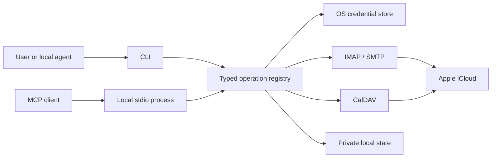

# Architecture

[← README](../README.md) · [Security model](security.md)

One operation registry sits behind both interfaces. The agent-facing skill explains
when to use those operations, how to carry IDs forward, and how to respect the user's
requested scope. It does not implement network access itself.

## Modules

| Module | Responsibility |
|---|---|
| `cli.py` | Commands, JSON input/output, interactive setup |
| `terminal.py` | Human terminal presentation, prompts, and progress |
| `operations.py` | Strict Pydantic schemas, operation metadata, dispatch, mutation lock |
| `mcp_server.py` | Official Python MCP SDK, stdio transport, tool annotations |
| `auth.py` | Native credential backend, private config, account lifecycle |
| `mail.py` | IMAPClient, Python email/SMTP, message references, send journal |
| `calendar.py` | python-caldav, iCalendar parsing, Apple URL checks, conditional writes |
| `errors.py` | Safe error envelopes without raw protocol exceptions |

The CLI and MCP perform the same operations; there is no second implementation to keep
in sync. Both load one active account on demand. No background sync or indexing service
is present. Each protocol operation opens a connection and closes it afterward.

## Important invariants

- Reads and searches use read-only folder selection and BODY.PEEK, leaving mail unread.
- Message references contain folder, UIDVALIDITY, and UID, not sequence numbers.
- Mail moves require atomic MOVE; deletion cleanup uses a targeted UID expunge.
- Sending requires a reviewed content hash. The local journal records intent before
  SMTP and blocks another attempt for the same draft ID. Post-send housekeeping can
  fail separately from submission.
- Calendar IDs come from discovery. Event resources must be under the selected
  calendar on an allowed HTTPS iCloud host. Redirects are checked before following.
- Calendar updates/deletes require the last-read ETag and an HTTP conditional write.
  Creates use If-None-Match. Unsupported series/meeting edits fail explicitly.
- Local writes share an operation lock. This cannot prevent another calendar/mail
  client from editing data; server preconditions and readbacks address that boundary.
- Unexpected errors omit raw protocol details. Returned mail/calendar contents are
  still private user data and remain untrusted as instructions.

## Dependencies and design choices

IMAPClient, python-caldav, icalendar, keyring, and the official MCP Python SDK handle
protocol and platform details. The standard library provides CLI parsing, mail
composition, and SMTP. Authentication uses Apple's supported app-specific-password
route rather than browser cookies or undocumented iCloud web sessions.

The local MCP process is sometimes called a “server” by the protocol, but it listens
on stdio, not a TCP port. The client may keep it alive for a session. No deployment,
public URL, launch agent, scheduled task, or system daemon is installed.

## Scope

The initial release focuses on one account, basic mail workflows, and personal events.
Recurring occurrence reads are supported; recurrence editing, attendee invitations,
RSVPs, attachment transfer, folder creation, multi-account routing, and contacts are
not. Changes in these areas should start with a focused issue describing the intended
user behavior and protocol requirements, not a promise of an imminent feature.

The proposed [guided account setup](authentication-design.md) records the intended
alias/calendar picker and the authentication questions that must be resolved first.
